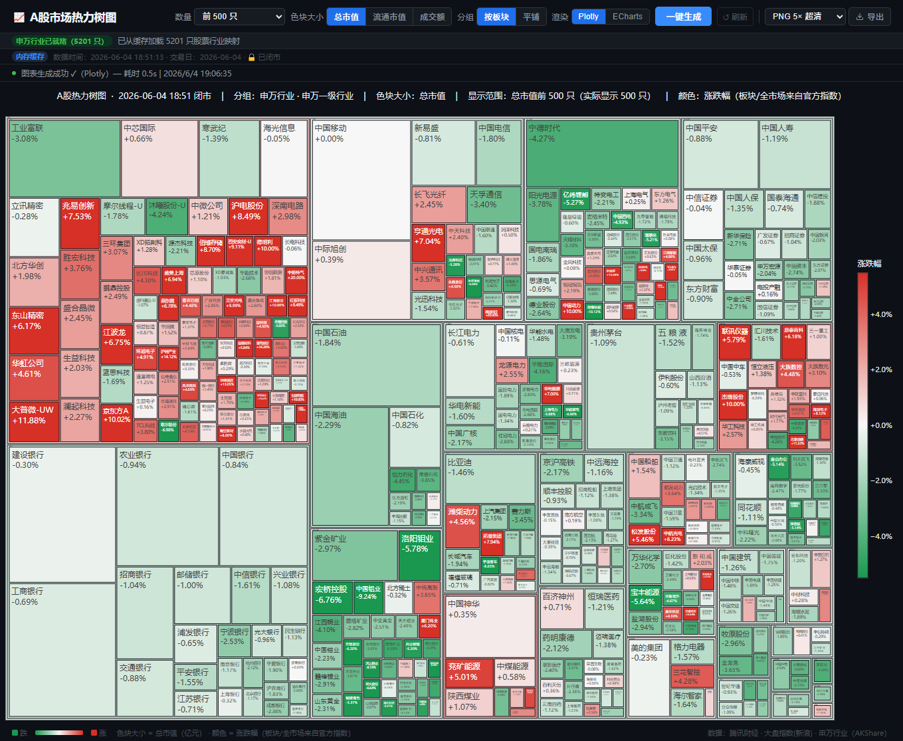
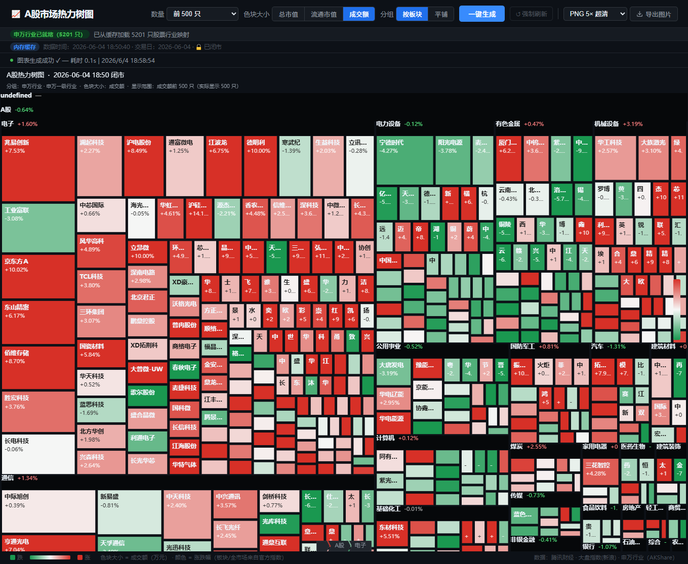
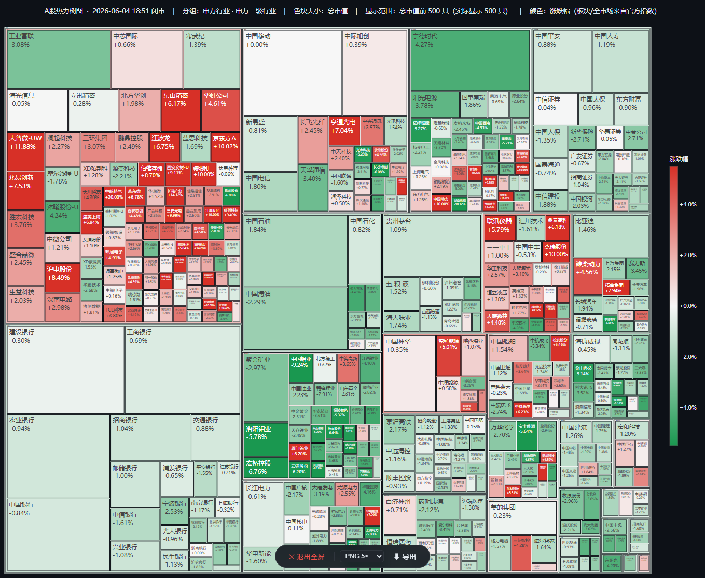

# A股热力树图 📊

实时 A股全市场热力树图（Treemap）。从腾讯财经等公开数据源拉取沪深北全市场行情，按**申万一级行业**分组，用**色块大小**表示成交额/市值、**颜色**表示涨跌幅，支持 Plotly / ECharts 双渲染器、全屏查看与图片导出。

本仓库提供**两个版本**，功能与界面一致，部署方式不同：

| | 🌐 网页版 [`web/`](web/) | 🧩 插件版 [`extension/`](extension/) |
|---|---|---|
| 形态 | Python 自建 Web 服务 | Chrome 扩展（Manifest V3） |
| 后端 | FastAPI + akshare | **无后端**，纯前端直连数据源 |
| 使用方式 | 启动服务后浏览器访问 | 点工具栏图标，在新标签页打开 |
| 数据缓存 | 内存 + 磁盘 JSON（按交易日） | 内存 + `chrome.storage.local` |
| 交易日历 | ✅ akshare 交易日历（识别节假日） | 仅排除周末 |
| 适用场景 | 团队/公网共享、定时缓存 | 个人本地使用，零部署、开箱即用 |

> 作者：**@可以叫我才哥**

---

## 📸 界面预览

> 两版界面一致，以下截图通用。

**Plotly 渲染器**（桌面默认，右侧带涨跌幅色带，交互强）



**ECharts 渲染器**（深色风格，板块上栏显示行业涨跌，移动端友好）



**全屏模式**（一键全屏，底部悬浮工具栏，按 Esc 退出）



---

## ✨ 通用功能（两版一致）

- **全市场覆盖**：沪市主板 + 科创板 + 深市 A股 + 北交所，约 5000+ 只股票
- **两种分组**：按申万一级行业分组 / 平铺（不分组）
- **三种色块大小**：成交额（万元）、总市值（亿元）、流通市值（亿元）
- **真实涨跌色**：板块 / 全市场颜色取自官方指数（申万行业指数、上证 A股指数），而非简单等权均值
- **Top-N 筛选**：可只看成交额/市值最大的前 N 只
- **双渲染器**：Plotly（桌面，交互强）与 ECharts（移动端友好），按需懒加载
- **全屏 + 导出**：一键全屏，支持导出 PNG/JPEG 图片
- **两级缓存 + single-flight**：盘后/重开秒载，缓存 miss 时同 key 只拉一次，避免重复打满上游

---

## 🔍 两版能力差异

两版功能与界面一致，差异主要在数据获取与运行方式上：

| 维度 | 🌐 网页版 | 🧩 插件版 |
|------|-----------|-----------|
| 运行环境 | Python 服务（自建/服务器） | 浏览器扩展（本机） |
| 行情数据源 | 腾讯行情 + 新浪指数 + akshare | 腾讯行情 + 三交易所官方接口 + 申万官网 |
| 代码列表来源 | akshare（封装好的接口） | 直连上交所/深交所/北交所官方接口 |
| 跨域/防盗链 | 服务端请求，无限制 | `declarativeNetRequest` 改写 Referer |
| 数据缓存 | 内存 + 磁盘 JSON（按交易日） | 内存 + `chrome.storage.local` |
| 行业映射缓存 | 磁盘 24h | `chrome.storage.local` 24h |
| **交易日历（节假日）** | ✅ akshare 交易日历 | ⛔ 仅排除周末 |
| 强制刷新限流 | ✅ 同 IP 30s/次 | —（本地使用无需） |
| 多用户/公网共享 | ✅ 适合 | ⛔ 仅本机 |
| 部署成本 | 需 Python 环境 + 可选 Nginx | 零部署，加载即用 |

> 唯一的能力差距是**节假日识别**：网页版借助 akshare 交易日历能准确判断法定节假日；插件版纯前端、无该数据源，目前仅排除周末（节假日当天仍会尝试拉取，但不影响数据正确性）。

---

# 🌐 网页版（`web/`）

Python + FastAPI 后端，适合部署成长期运行的服务，供多人访问或定时刷新缓存。

## 技术架构

```
浏览器 (web/static/index.html, 单页)
   │  GET /                → 首页 HTML
   │  GET /api/heatmap     → 热力图 JSON
   │  GET /api/sector-status / cache-status
   ▼
FastAPI (web/app.py)
   ├─ 两级缓存：内存 + cache/*.json（按交易日）
   ├─ single-flight 锁：缓存 miss 时同 key 只拉一次
   └─ 3 路并发拉取
        ├─ 腾讯行情批量 API（200 只/批，10 线程）→ 个股涨跌/成交额/市值
        ├─ 新浪指数 sh000002                       → 大盘根节点涨跌幅
        └─ 申万行业实时指数 (akshare)              → 板块节点涨跌幅
   └─ 申万行业映射 / 交易日历：启动后台预热 + 磁盘缓存
```

**技术栈**：FastAPI · Uvicorn/Gunicorn · pandas · akshare · requests · Plotly · ECharts

## 快速开始

```bash
cd web
pip install -r requirements.txt
python app.py            # 开发模式，热重载
```
浏览器打开 <http://localhost:8000>

> 首次启动会在后台拉取股票代码列表、申万行业映射和交易日历（约 30–60 秒），
> 期间页面顶部显示「申万行业加载中」进度，加载完成前分组临时使用交易所板块兜底。

## API 说明

### `GET /api/heatmap`
| 参数 | 类型 | 默认 | 说明 |
|------|------|------|------|
| `top_n` | int | `500` | 只取前 N 只（`0` = 全部），范围 0–10000 |
| `group_by` | str | `sector` | `sector`（申万行业） / `none`（平铺） |
| `size_by` | str | `vol` | `vol`（成交额） / `mktcap`（总市值） / `float_cap`（流通市值） |
| `force` | bool | `false` | 跳过缓存强制重拉（**同一 IP 限流 30 秒一次**，超频自动降级为读缓存） |

响应（节选）：
```jsonc
{
  "title": "A股热力树图  ·  2026-06-18 15:00 闭市  | ...",  // 每次响应按当前时间动态生成
  "size_by": "vol", "size_label": "成交额", "size_unit": "万元",
  "root": {
    "n": "A股", "v": 76393422.0, "g": 0.0123, "cnt": 5188,
    "children": [ { "n": "电子", "v": ..., "g": ..., "children": [ ... ] } ]
  },
  "trading_date": "2026-06-18",
  "market_status": "closed",        // open / closed
  "cache_type": "memory"            // fresh / memory / disk
}
```
- `GET /api/sector-status` — 申万行业映射构建进度 `{ ready, progress, count }`
- `GET /api/cache-status` — 磁盘缓存文件列表、交易日与市场状态

## 配置（环境变量 / 常量）

| 变量 | 默认 | 说明 |
|------|------|------|
| `ALLOW_ORIGINS` | `*` | CORS 允许来源，逗号分隔；如 `https://a.com,https://b.com` |

`web/app.py` 顶部常量：`MARKET_OPEN_TTL`(120s 盘中内存) · `SW_CACHE_TTL`(300s 行业实时) · `CODE_LIST_TTL`(6h) · `SECTOR_MAP_TTL`/`TRADE_CAL_TTL`(24h) · `FORCE_MIN_INTERVAL`(30s) · `CACHE_VERSION`(v4，结构变更时递增，旧缓存自动失效)。

## 生产部署（Gunicorn + Nginx + systemd）

```bash
cd web
gunicorn -c gunicorn.conf.py app:app    # 单 worker + 4 线程
```
> 单 worker 是因为内存缓存不跨进程，多 worker 会重复拉取上游。

<details>
<summary>systemd 服务示例</summary>

```ini
# /etc/systemd/system/stock-heatmap.service
[Unit]
Description=A股热力树图
After=network.target

[Service]
WorkingDirectory=/opt/stock-heatmap/web
ExecStart=/opt/stock-heatmap/.venv/bin/gunicorn -c gunicorn.conf.py app:app
Restart=always
Environment=ALLOW_ORIGINS=https://your-domain.com

[Install]
WantedBy=multi-user.target
```
</details>

<details>
<summary>Nginx 反向代理示例</summary>

```nginx
server {
    listen 80;
    server_name your-domain.com;
    location / {
        proxy_pass http://127.0.0.1:8000;
        proxy_set_header Host $host;
        proxy_set_header X-Real-IP $remote_addr;
        proxy_read_timeout 180s;   # 首次全市场拉取较慢
    }
}
```
</details>

---

# 🧩 插件版（`extension/`）

Chrome / Edge 浏览器扩展（Manifest V3），**纯前端、零部署**。把网页版的逻辑完整移植到浏览器中，直接从各官方接口取数，无需任何服务器。

## 工作原理

```
点击工具栏图标 (background.js)
   └─ 新标签页打开 newtab.html
        ├─ src/market.js   市场时间 / 交易日 / 代码归一化
        ├─ src/data.js     6 个数据源直连拉取
        │     ├─ qt.gtimg.cn          腾讯批量行情（GBK 解码）
        │     ├─ query.sse.com.cn     上交所代码列表
        │     ├─ www.szse.cn          深交所代码列表（xlsx，用 xlsx.mini 解析）
        │     ├─ www.bse.cn           北交所代码列表（分页）
        │     └─ www.swsresearch.com  申万一级行业映射 + 实时涨跌
        ├─ src/cache.js    两级缓存：内存 + chrome.storage.local
        └─ src/heatmap.js  组装树图数据，newtab.js 用 Plotly/ECharts 渲染
```

**跨域与防盗链**：扩展通过 `host_permissions` 获得跨域 fetch 能力，并用 `declarativeNetRequest`（[`rules.json`](extension/rules.json)）改写对上交所/腾讯/深交所请求的 `Referer` 头，绕过防盗链限制——这是浏览器扩展能纯前端取数、而普通网页做不到的关键。

## 安装（开发者模式加载）

1. 打开 Chrome，地址栏输入 `chrome://extensions/`
2. 右上角打开 **开发者模式**
3. 点 **加载已解压的扩展程序**，选择本仓库的 `extension/` 目录
4. 点击工具栏出现的图标，即在新标签页打开热力图

> Edge 同理：`edge://extensions/` → 开发人员模式 → 加载解压缩的扩展。

## 打包发布（可选）

`chrome://extensions/` → **打包扩展程序** → 选择 `extension/` 目录，生成 `.crx` 与私钥 `.pem`（妥善保管私钥用于后续更新）。或上传到 Chrome 网上应用店。

## 权限说明

| 权限 | 用途 |
|------|------|
| `storage` | 缓存热力图数据到 `chrome.storage.local` |
| `declarativeNetRequest` | 改写请求 Referer 头以绕过数据源防盗链 |
| `host_permissions` | 仅限上述 5 个数据源域名，**不访问任何其他网站** |

> 插件不收集、不上传任何用户数据，所有请求直连公开行情接口。

---

## 📁 仓库结构

```
stock-heatmap/
├── README.md              # 本文件（同时介绍两版）
├── web/                   # 🌐 网页版（FastAPI）
│   ├── app.py             #   行情拉取、分组、缓存、API
│   ├── static/            #   单页前端 + Plotly/ECharts
│   ├── gunicorn.conf.py   #   生产部署配置
│   ├── requirements.txt
│   ├── cache/             #   运行时缓存（不入库，自动生成）
│   └── sector_map.json    #   行业映射缓存（不入库，自动重建）
└── extension/             # 🧩 插件版（Chrome MV3）
    ├── manifest.json
    ├── background.js      #   点击图标 → 开新标签页
    ├── newtab.html / .js  #   界面与渲染
    ├── rules.json         #   declarativeNetRequest Referer 改写规则
    ├── lib/               #   Plotly / ECharts / xlsx
    └── src/               #   market / data / cache / heatmap
```

---

## 📝 说明与已知限制

- 数据来源为腾讯财经 / 新浪 / 各交易所 / 申万官网等公开接口，仅供学习研究，**不构成任何投资建议**。
- 网页版交易日历依赖 akshare，获取失败会自动退回「仅排除周末」逻辑；插件版仅排除周末。
- 网页版建议单 worker 部署（内存缓存不跨进程）。
- 上游接口字段/防盗链策略可能变动，若拉取失败请检查数据源是否调整。

## 📄 License

MIT
