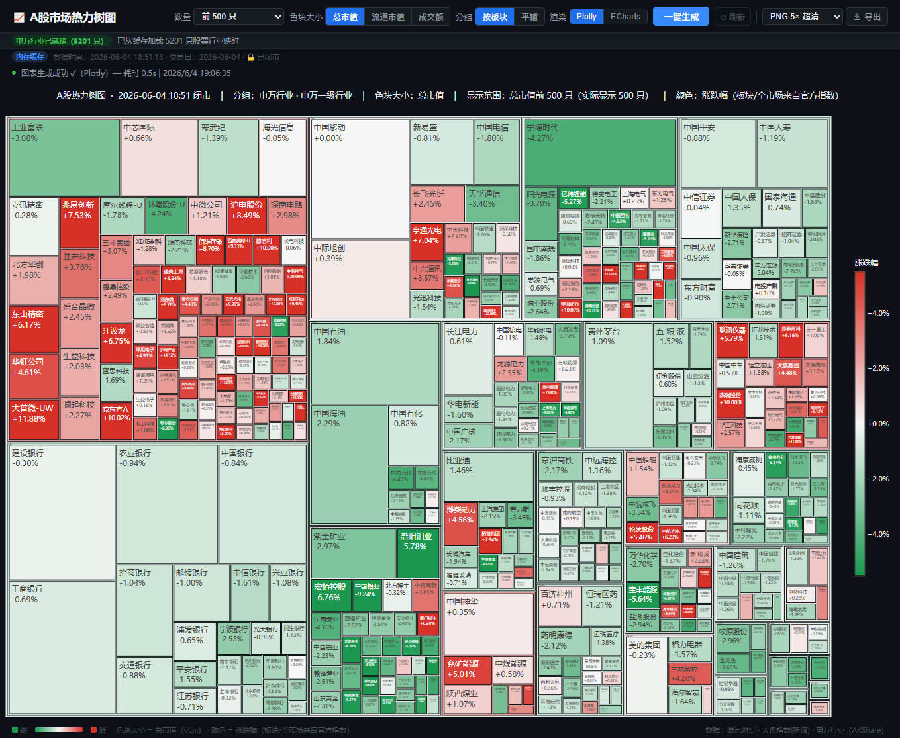
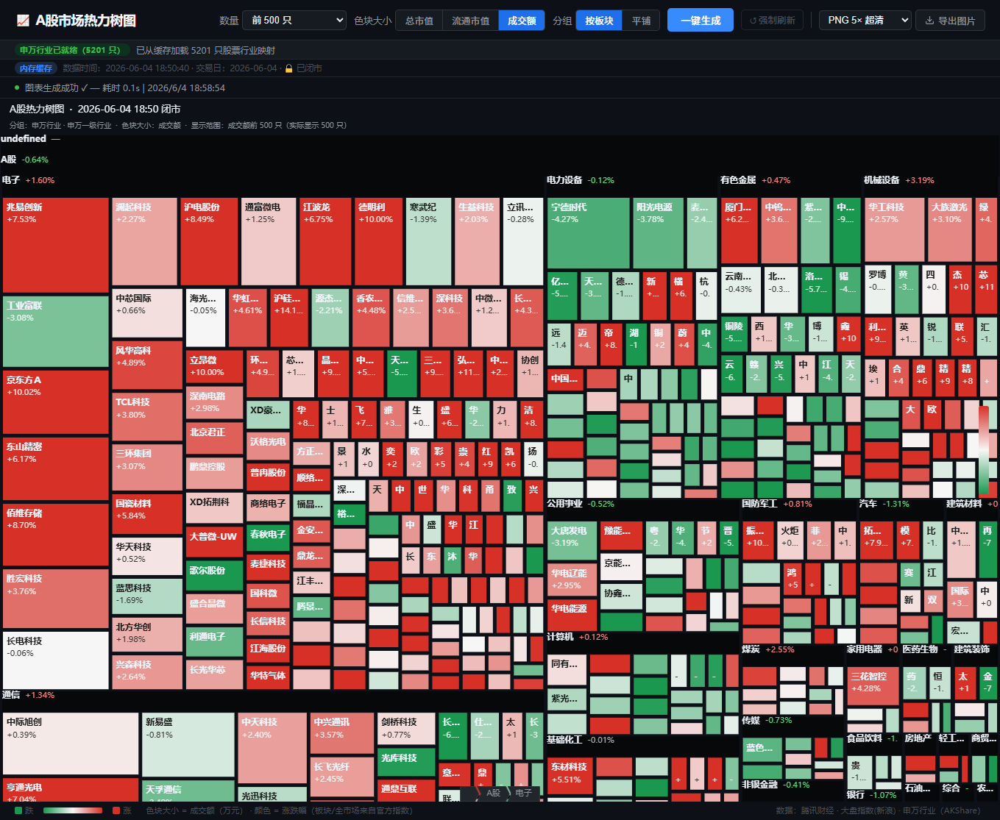
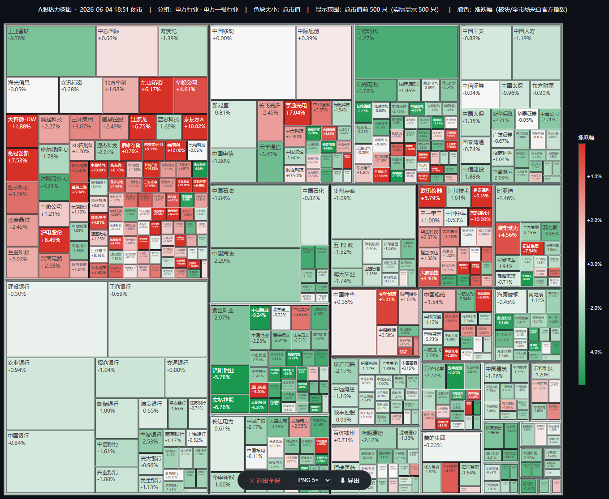

# A股热力树图 📊

实时 A股全市场热力树图（Treemap）。从腾讯财经等公开数据源拉取沪深北全市场行情，按**申万一级行业**分组，用**色块大小**表示成交额/市值、**颜色**表示涨跌幅，支持 Plotly / ECharts 双渲染器、全屏查看与图片导出。

本仓库提供**三个版本**，功能与界面一致，部署方式不同：

| | 🌐 网页版 [`web/`](web/) | 🧩 插件版 [`extension/`](extension/) | 🤖 Skill 版 [`skill/`](skill/) |
|---|---|---|---|
| 形态 | Python 自建 Web 服务 | Chrome 扩展（Manifest V3） | WorkBuddy 智能体 Skill |
| 后端 | FastAPI + akshare | **无后端**，纯前端直连数据源 | 纯标准库脚本（仅 requests） |
| 使用方式 | 启动服务后浏览器访问 | 点工具栏图标，在新标签页打开 | 对 WorkBuddy 说「生成 A股热力图」 |
| 数据缓存 | 内存 + 磁盘 JSON（按交易日） | 内存 + `chrome.storage.local` | 磁盘 JSON（申万映射 24h） |
| 交易日历 | ✅ akshare 交易日历（识别节假日） | ✅ 新浪交易日历（识别节假日） | ⚠️ 仅排除周末（无节假日日历） |
| 适用场景 | 团队/公网共享、定时缓存 | 个人本地使用，零部署、开箱即用 | AI 对话内一键出图、内嵌筛选器 |

> 作者：**@可以叫我才哥**

---

## 📸 界面预览

> 三版界面一致，以下截图通用。

**Plotly 渲染器**（桌面默认，右侧带涨跌幅色带，交互强）



**ECharts 渲染器**（深色风格，板块上栏显示行业涨跌，移动端友好）



**全屏模式**（一键全屏，底部悬浮工具栏，按 Esc 退出）



---

## ✨ 通用功能（三版一致）

- **全市场覆盖**：沪市主板 + 科创板 + 深市 A股 + 北交所，约 5000+ 只股票
- **两种分组**：按申万一级行业分组 / 平铺（不分组）
- **三种色块大小**：成交额（万元）、总市值（亿元）、流通市值（亿元）
- **真实涨跌色**：板块 / 全市场颜色取自官方指数（申万行业指数、上证 A股指数），而非简单等权均值
- **Top-N 筛选**：可只看成交额/市值最大的前 N 只
- **双渲染器**：Plotly（桌面，交互强）与 ECharts（移动端友好），按需懒加载
- **全屏 + 导出**：一键全屏，支持导出 PNG/JPEG 图片
- **两级缓存 + single-flight**：盘后/重开秒载，缓存 miss 时同 key 只拉一次，避免重复打满上游

---

## 🔍 三版能力差异

三版功能与界面一致，差异主要在数据获取与运行方式上：

| 维度 | 🌐 网页版 | 🧩 插件版 | 🤖 Skill 版 |
|------|-----------|-----------|-------------|
| 运行环境 | Python 服务（自建/服务器） | 浏览器扩展（本机） | WorkBuddy 对话 / 命令行 |
| 行情数据源 | 腾讯行情 + 新浪指数 + akshare | 腾讯行情 + 三交易所官方接口 + 申万官网 + 新浪交易日历 | 腾讯行情 + 申万官网 |
| 代码列表来源 | akshare（封装好的接口） | 直连上交所/深交所/北交所官方接口 | 交易所板块代码段近似兜底 |
| 跨域/防盗链 | 服务端请求，无限制 | `declarativeNetRequest` 改写 Referer | 无（本地脚本直连） |
| 数据缓存 | 内存 + 磁盘 JSON（按交易日） | 内存 + `chrome.storage.local` | 磁盘 JSON（申万映射 24h） |
| 行业映射缓存 | 磁盘 24h | `chrome.storage.local` 24h | 磁盘 24h |
| **交易日历（节假日）** | ✅ akshare 交易日历 | ✅ 新浪交易日历（前端解码） | ⚠️ 仅排除周末 |
| **内嵌筛选器** | ❌ 需刷新请求 | ❌ 需刷新请求 | ✅ 浏览器内实时切换 |
| 强制刷新限流 | ✅ 同 IP 30s/次 | —（本地使用无需） | —（本地脚本无需） |
| 多用户/公网共享 | ✅ 适合 | ⛔ 仅本机 | ⛔ 仅本机 |
| 部署成本 | 需 Python 环境 + 可选 Nginx | 零部署，加载即用 | 需 Python 环境（标准库） |

> 三版均能识别交易日：网页版借助 akshare 交易日历；插件版纯前端直连新浪同源交易日历接口（`klc_td_sh.txt`），用内置解码器还原出当年完整交易日并缓存到 `chrome.storage.local`；Skill 版为降低依赖，仅按周末排除（不含法定节假日）。若日历接口拉取失败，网页版/插件版会自动退回「仅排除周末」逻辑，不影响数据正确性。

---

# 🌐 网页版（`web/`）

Python + FastAPI 后端，适合部署成长期运行的服务，供多人访问或定时刷新缓存。

## 技术架构

```
浏览器 (web/static/index.html, 单页)
   │  GET /                → 首页 HTML
   │  GET /api/heatmap     → 热力图 JSON
   │  GET /api/sector-status / cache-status
   ▼
FastAPI (web/app.py)
   ├─ 两级缓存：内存 + cache/*.json（按交易日）
   ├─ single-flight 锁：缓存 miss 时同 key 只拉一次
   └─ 3 路并发拉取
        ├─ 腾讯行情批量 API（200 只/批，10 线程）→ 个股涨跌/成交额/市值
        ├─ 新浪指数 sh000002                       → 大盘根节点涨跌幅
        └─ 申万行业实时指数 (akshare)              → 板块节点涨跌幅
   └─ 申万行业映射 / 交易日历：启动后台预热 + 磁盘缓存
```

**技术栈**：FastAPI · Uvicorn/Gunicorn · pandas · akshare · requests · Plotly · ECharts

## 快速开始

```bash
cd web
pip install -r requirements.txt
python app.py            # 开发模式，热重载
```
浏览器打开 <http://localhost:8000>

> 首次启动会在后台拉取股票代码列表、申万行业映射和交易日历（约 30–60 秒），
> 期间页面顶部显示「申万行业加载中」进度，加载完成前分组临时使用交易所板块兜底。

## API 说明

### `GET /api/heatmap`
| 参数 | 类型 | 默认 | 说明 |
|------|------|------|------|
| `top_n` | int | `500` | 只取前 N 只（`0` = 全部），范围 0–10000 |
| `group_by` | str | `sector` | `sector`（申万行业） / `none`（平铺） |
| `size_by` | str | `vol` | `vol`（成交额） / `mktcap`（总市值） / `float_cap`（流通市值） |
| `force` | bool | `false` | 跳过缓存强制重拉（**同一 IP 限流 30 秒一次**，超频自动降级为读缓存） |

响应（节选）：
```jsonc
{
  "title": "A股热力树图  ·  2026-06-18 15:00 闭市  | ...",  // 每次响应按当前时间动态生成
  "size_by": "vol", "size_label": "成交额", "size_unit": "万元",
  "root": {
    "n": "A股", "v": 76393422.0, "g": 0.0123, "cnt": 5188,
    "children": [ { "n": "电子", "v": ..., "g": ..., "children": [ ... ] } ]
  },
  "trading_date": "2026-06-18",
  "market_status": "closed",        // open / closed
  "cache_type": "memory"            // fresh / memory / disk
}
```
- `GET /api/sector-status` — 申万行业映射构建进度 `{ ready, progress, count }`
- `GET /api/cache-status` — 磁盘缓存文件列表、交易日与市场状态

## 配置（环境变量 / 常量）

| 变量 | 默认 | 说明 |
|------|------|------|
| `ALLOW_ORIGINS` | `*` | CORS 允许来源，逗号分隔；如 `https://a.com,https://b.com` |

`web/app.py` 顶部常量：`MARKET_OPEN_TTL`(120s 盘中内存) · `SW_CACHE_TTL`(300s 行业实时) · `CODE_LIST_TTL`(6h) · `SECTOR_MAP_TTL`/`TRADE_CAL_TTL`(24h) · `FORCE_MIN_INTERVAL`(30s) · `CACHE_VERSION`(v4，结构变更时递增，旧缓存自动失效)。

## 生产部署（Gunicorn + Nginx + systemd）

```bash
cd web
gunicorn -c gunicorn.conf.py app:app    # 单 worker + 4 线程
```
> 单 worker 是因为内存缓存不跨进程，多 worker 会重复拉取上游。

<details>
<summary>systemd 服务示例</summary>

```ini
# /etc/systemd/system/stock-heatmap.service
[Unit]
Description=A股热力树图
After=network.target

[Service]
WorkingDirectory=/opt/stock-heatmap/web
ExecStart=/opt/stock-heatmap/.venv/bin/gunicorn -c gunicorn.conf.py app:app
Restart=always
Environment=ALLOW_ORIGINS=https://your-domain.com

[Install]
WantedBy=multi-user.target
```
</details>

<details>
<summary>Nginx 反向代理示例</summary>

```nginx
server {
    listen 80;
    server_name your-domain.com;
    location / {
        proxy_pass http://127.0.0.1:8000;
        proxy_set_header Host $host;
        proxy_set_header X-Real-IP $remote_addr;
        proxy_read_timeout 180s;   # 首次全市场拉取较慢
    }
}
```
</details>

---

# 🧩 插件版（`extension/`）

Chrome / Edge 浏览器扩展（Manifest V3），**纯前端、零部署**。把网页版的逻辑完整移植到浏览器中，直接从各官方接口取数，无需任何服务器。

## 工作原理

```
点击工具栏图标 (background.js)
   └─ 新标签页打开 newtab.html
        ├─ src/market.js    市场时间 / 交易日判断 / 代码归一化
        ├─ src/calendar.js  新浪交易日历（识别法定节假日）
        │     └─ finance.sina.com.cn  klc_td_sh.txt（用 lib/sina-date-decode 解码）
        ├─ src/data.js      5 个行情数据源直连拉取
        │     ├─ qt.gtimg.cn          腾讯批量行情（GBK 解码）
        │     ├─ query.sse.com.cn     上交所代码列表
        │     ├─ www.szse.cn          深交所代码列表（xlsx，用 xlsx.mini 解析）
        │     ├─ www.bse.cn           北交所代码列表（分页）
        │     └─ www.swsresearch.com  申万一级行业映射 + 实时涨跌
        ├─ src/cache.js     两级缓存：内存 + chrome.storage.local
        └─ src/heatmap.js   组装树图数据，newtab.js 用 Plotly/ECharts 渲染
```

**跨域与防盗链**：扩展通过 `host_permissions` 获得跨域 fetch 能力，并用 `declarativeNetRequest`（[`rules.json`](extension/rules.json)）改写对上交所/腾讯/深交所请求的 `Referer` 头，绕过防盗链限制——这是浏览器扩展能纯前端取数、而普通网页做不到的关键。

## 安装（开发者模式加载）

1. 打开 Chrome，地址栏输入 `chrome://extensions/`
2. 右上角打开 **开发者模式**
3. 点 **加载已解压的扩展程序**，选择本仓库的 `extension/` 目录
4. 点击工具栏出现的图标，即在新标签页打开热力图

> Edge 同理：`edge://extensions/` → 开发人员模式 → 加载解压缩的扩展。

## 打包发布（可选）

`chrome://extensions/` → **打包扩展程序** → 选择 `extension/` 目录，生成 `.crx` 与私钥 `.pem`（妥善保管私钥用于后续更新）。或上传到 Chrome 网上应用店。

## 权限说明

| 权限 | 用途 |
|------|------|
| `storage` | 缓存热力图数据到 `chrome.storage.local` |
| `declarativeNetRequest` | 改写请求 Referer 头以绕过数据源防盗链 |
| `host_permissions` | 仅限上述 6 个数据源域名（含新浪交易日历），**不访问任何其他网站** |

> 插件不收集、不上传任何用户数据，所有请求直连公开行情接口。

---

# 🤖 Skill 版（`skill/`）

把网页版的核心逻辑封装成 **WorkBuddy 智能体 Skill**：无需启动服务、无需浏览器扩展，在 WorkBuddy 对话里说一句「生成 A股热力图」，即可一键拉取全市场行情并渲染成交互式 Treemap。

## 什么是 WorkBuddy Skill

[WorkBuddy](https://www.workbuddy.cn/) 的 Skill 是一种可复用的能力封装，让 AI 智能体在特定任务下自动加载专门的工作流与脚本。本 Skill 面向「A股行情可视化」场景，沉淀了从数据源、字段解析、申万行业分组到前端渲染的完整实现。

## 目录结构

```
skill/
├── SKILL.md                        # 触发词 + 工作流说明（AI 据此加载与执行）
├── scripts/
│   └── generate_heatmap.py         # 核心脚本：拉行情 → 申万分组 → 生成树图数据
├── assets/
│   └── template.html               # 自包含 Plotly Treemap 前端（内嵌交互筛选器）
└── references/
    └── implementation.md           # 完整实现知识沉淀（数据源/字段解析/分组逻辑）
```

## 核心能力

- **一键出图**：`python scripts/generate_heatmap.py --html --out heatmap.html` 直接产出可交互 HTML。
- **零重依赖**：纯 Python 标准库 + `requests`，**不依赖 akshare / plotly / pandas**。
- **真实申万分组**：直连申万官网拉取 31 个一级行业 + 成分股，构建「代码 → 行业」映射（磁盘缓存 24h），行业涨跌幅取自官方申万指数。
- **多维度组合筛选**：ST 股 / 科创板 / 创业板 / 北交所 / 沪主板 / 深主板，支持包含（并集）与排除两套逻辑。
- **内嵌筛选器**：`--html` 模式把全量数据 + 筛选逻辑下放到浏览器端，页面内实时切换分组 / 色块大小 / Top-N / 筛选维度，**无需重新跑脚本**。

## 快速开始

```bash
# 方式一：一键生成带筛选器的交互式 HTML（推荐）
python scripts/generate_heatmap.py --html --out heatmap.html

# 方式二：生成数据 JSON（脚本端筛选）
python scripts/generate_heatmap.py \
  --top-n 0 \            # 0 = 全部，默认 500
  --group-by sw \        # sw(申万行业) | board(交易所板块) | none(平铺)
  --size-by mktcap \     # vol(成交额) | mktcap(总市值) | float_cap(流通市值)
  --include KCB,BSE \    # 包含筛选（并集）：只看科创板+北交所
  --exclude ST \         # 排除筛选：剔除所有 ST 股
  --out heatmap.json
```

筛选维度：`ST`（ST/*ST 股）、`KCB`（科创板）、`CYB`（创业板）、`BSE`（北交所）、`SH`（沪主板）、`SZ`（深主板）。`--include` 为并集（包含即保留），`--exclude` 为排除，二者可叠加（排除优先）。

## 安装到 WorkBuddy

将 `skill/` 目录复制到 `~/.workbuddy/skills/a-share-heatmap/`（用户级，跨项目可用），之后在 WorkBuddy 对话中直接说「生成 A股热力图」即可触发。

## 与网页版/插件版的差异

- **依赖最小**：脚本版为降低依赖，代码列表用交易所板块代码段近似兜底（实测覆盖约 5500 只真实股票），交易日历仅排除周末（不含法定节假日）。
- **申万映射直连**：不依赖 akshare，直接调用申万官网 `swsresearch.com` 的行业列表 + 成分股接口；接口失败时自动降级为交易所板块分组。
- **筛选器内嵌**：网页版/插件版需刷新请求切换条件，Skill 版把筛选/分组/Top-N 全部下放到浏览器端实时完成。

> 详细实现（数据源、腾讯行情字段索引、申万字段口径、分组/涨跌计算、缓存与市场时间判断）见 [`skill/references/implementation.md`](skill/references/implementation.md)。

---

## 📁 仓库结构

```
stock-heatmap/
├── README.md              # 本文件（同时介绍三版）
├── web/                   # 🌐 网页版（FastAPI）
│   ├── app.py             #   行情拉取、分组、缓存、API
│   ├── static/            #   单页前端 + Plotly/ECharts
│   ├── gunicorn.conf.py   #   生产部署配置
│   ├── requirements.txt
│   ├── cache/             #   运行时缓存（不入库，自动生成）
│   └── sector_map.json    #   行业映射缓存（不入库，自动重建）
├── extension/             # 🧩 插件版（Chrome MV3）
│   ├── manifest.json
│   ├── background.js      #   点击图标 → 开新标签页
│   ├── newtab.html / .js  #   界面与渲染
│   ├── rules.json         #   declarativeNetRequest Referer 改写规则
│   ├── lib/               #   Plotly / ECharts / xlsx / 新浪日历解码器
│   └── src/               #   market / calendar / data / cache / heatmap
└── skill/                 # 🤖 Skill 版（WorkBuddy 智能体）
    ├── SKILL.md           #   触发词 + 工作流说明
    ├── scripts/generate_heatmap.py   # 核心脚本
    ├── assets/template.html          # 自包含 Plotly 前端
    └── references/implementation.md  # 实现知识沉淀
```

---

## 📝 说明与已知限制

- 数据来源为腾讯财经 / 新浪 / 各交易所 / 申万官网等公开接口，仅供学习研究，**不构成任何投资建议**。
- 网页版/插件版均识别法定节假日（网页版 akshare 日历、插件版新浪日历）；Skill 版仅排除周末。任一获取失败都会自动退回「仅排除周末」逻辑。
- 网页版建议单 worker 部署（内存缓存不跨进程）。
- 上游接口字段/防盗链策略可能变动，若拉取失败请检查数据源是否调整。

## 📄 License

MIT
